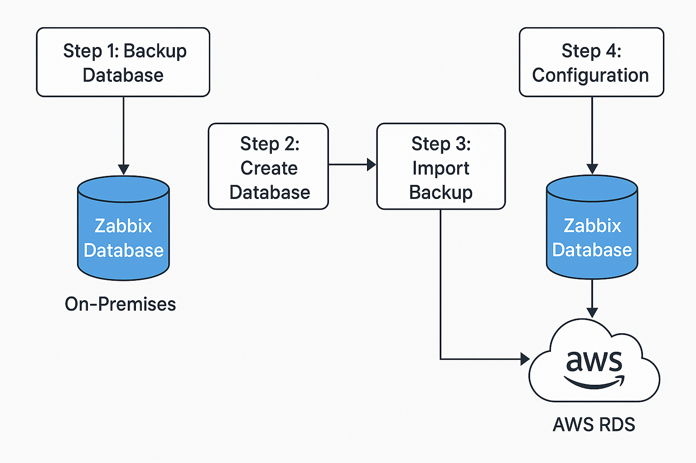

# 🛠️ How to Seamlessly Migrate Your Zabbix Database to AWS RDS (Zero Downtime Blueprint)

## 🔧 Why This Matters

Zabbix is a powerful monitoring tool, but managing its database on-prem can be limiting. Migrating to **AWS RDS** brings scalability, availability, and easier maintenance—**if done right**.

This is a **battle-tested, step-by-step migration guide** to move your Zabbix database without downtime or drama.

---

## ☁️ Step 1: Backup the Current Zabbix Database (The Safety Net)

Before touching production, create a reliable snapshot of your data:

```bash
mysqldump --single-transaction zabbix | gzip > /mnt/zbx-dump.sql.gz
```

✅ **Tip**: Use `--single-transaction` for consistency during active writes.

---

## 🏗️ Step 2: Prepare AWS RDS and Create the Zabbix Database

Spin up your AWS RDS instance and grant access to the new database:

```sql
CREATE DATABASE zabbix;
GRANT ALL PRIVILEGES ON zabbix.* TO '<zbx_user>'@'%' IDENTIFIED BY '<password>';
FLUSH PRIVILEGES;
```

💡 **Pro Tip**: Tweak your RDS parameter group for better performance (`max_connections`, `innodb_buffer_pool_size`, etc.)

---

## 🚀 Step 3: Import the Zabbix Dump into AWS RDS

Transfer the data to your new RDS instance:

```bash
mysql -h <aws-rds-endpoint> -u <zbx_user> -p zabbix < /mnt/zbx-dump.sql
```

✅ **Tip**: Use `mysqlimport` or `pv` for larger datasets to track progress.

---

## 🔧 Step 4: Reconfigure Zabbix to Use the New Database

Update your Zabbix config files:

**Edit `zabbix_server.conf`:**

```ini
DBHost=<aws-rds-endpoint>
```

**Edit `zabbix.conf.php`:**

```php
$DB['SERVER'] = '<aws-rds-endpoint>';
```

Restart services:

```bash
sudo systemctl restart zabbix-server
sudo systemctl restart apache2
```

---

## 🧪 Step 5: Test, Monitor, and Be Ready to Roll Back

**✅ Test:**
- Frontend dashboards and widgets
- Zabbix server logs
- Trigger & alert accuracy

**🛠️ If issues arise:**
- Revert to your old DB (still intact)
- Drop/recreate RDS DB and retry migration

---

## 🖼️ Zabbix to AWS RDS Migration Diagram

Below is a high-level visual of the end-to-end migration process:



Moving Zabbix Database to AWS RDS/zabbix-to-rds-migration-diagram.png.png

> 📌 _Make sure to place the image `zabbix-to-rds-migration-diagram.png` in the same directory._

---

## 🎯 Final Words

This isn’t just a database move—it’s a foundational upgrade. With AWS RDS, you gain a **scalable**, **highly available**, and **maintenance-light** setup for your Zabbix environment.

> 🚀 Ready to take your monitoring to the cloud? This guide is your blueprint.
